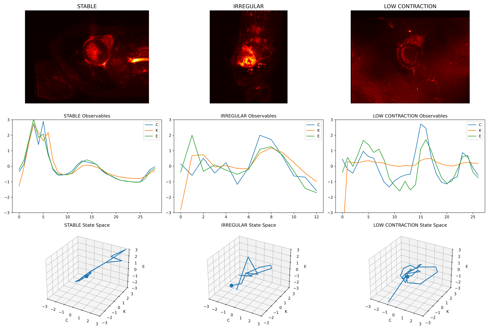
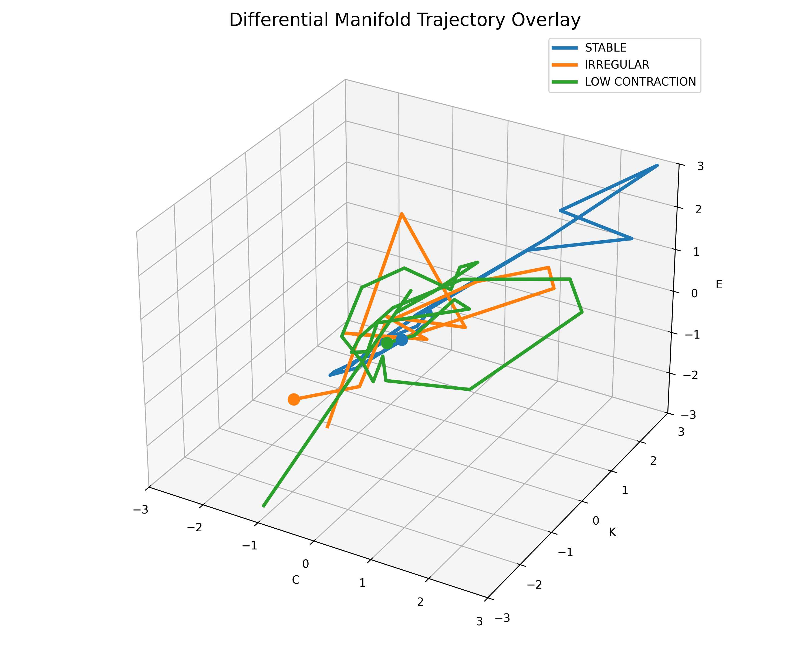

# AURORA

## Detector-Plane Dynamical Observability Framework for Spatiotemporal Signal Fields

AURORA is a detector-plane dynamical observability framework that transforms spatiotemporal signal evolution into low-dimensional observable manifolds.

Rather than relying on segmentation, supervised learning, or diagnostic classification, AURORA analyzes the geometry of detector-conditioned observable evolution.

The framework has been evaluated using cardiac cine MRI as a dynamical signal-field testbed. This work establishes research-level dynamical observability evidence, not clinical diagnostic validation.

---

# Core Concept

AURORA treats observable evolution as the primary object of analysis.

The framework transforms:

V(x,y,z,t)

into detector-conditioned observable trajectories:

X(t)=[C(t),K(t),E(t)]

where:
- C represents coherence-related structure,
- K represents instability-sensitive dynamics,
- E represents detector energy/activity.

Distinct dynamical regimes produce distinct manifold geometries in observable state space.


---

# Canonical Validation Findings

Canonical experiments produced:

- coherent low-dimensional manifold structure,

- observable synchronization,

- relational-coupling and flow-structure dynamics,

- bounded instability,

- and differential regime geometry.

Three representative dynamical regimes were selected for canonical visualization:

| Regime | Dynamical Signature |
|---|---|
| Stable | Coherent damped manifold |
| Irregular | Fragmented angular geometry |
| Low Contraction | Compressed low-energy manifold |

These labels are phenomenological AURORA descriptors, not ACDC diagnostic labels or clinically validated disease classes.

The representative cases are:

| AURORA descriptor | ACDC case |
|---|---|
| Stable | patient029 |
| Irregular | patient094 |
| Low Contraction | patient008 |

Their selection can be traced to an earlier exploratory AURORA motion-strength heuristic. The historical MSI thresholds used for that selection were engineering heuristics and were not clinically calibrated diagnostic cut-offs.

See `docs/scientific-integrity/DATA_PROVENANCE.md` for the complete provenance and validation-boundary record.

---

# Figure 1 — Differential Regime Comparison



Top row:
Detector accumulation structure.

Middle row:
Observable evolution for:
- coherence (C)
- instability sensitivity (K)
- detector energy (E)

Bottom row:
Low-dimensional observable trajectories embedded in detector state space.

Distinct dynamical regimes produce distinct manifold morphologies.


---

# Figure 2 — Differential Manifold Trajectory Overlay



Overlay of detector-conditioned observable trajectories across:
- stable
- irregular
- low-contraction regimes

The trajectories occupy distinct geometric regions while remaining bounded and dynamically structured.

---

# Detector Evolution Lineage

Canonical detector hierarchy:

```text
src_canonical/
├── aurora_v6_core.py
├── aurora_final_pipeline.py
├── v17_2_multidim_pipeline.py
├── v17_3_normalized_detector.py
├── v18_phase_aware_detector.py
├── v19_optical_flow_detector.py
└── v20_topology_detector.py
```

Detector evolution progression:

> **Terminology note:** Historical detector filenames are preserved for
> reproducibility. V18 does not implement formal phase-synchronization analysis;
> its implemented FFT-derived quantity is better described as spectral
> concentration. V20 does not implement persistent homology or other formal
> topological-data-analysis methods; its implemented extensions measure
> inter-regional coupling and optical-flow divergence structure. See
> `docs/scientific-integrity/METHODOLOGICAL_REFERENCES.md`.


| Generation | Primary Contribution |
|---|---|
| Accumulation Detector | Motion persistence |
| Regional Detector | Spatial observability |
| Normalized Detector | Invariant manifold geometry |
| Phase-Aware Detector (historical name) | Spectral concentration / dominant-frequency structure |
| Optical Flow Detector | Farnebäck dense optical-flow vector dynamics |
| Topology-Aware Detector (historical name) | Relational coupling / flow-divergence structure |

---

# Repository Structure

```text
docs/
examples/
outputs/
src/
src_canonical/
archive_experimental/
```

---

# Validation Workflow

Canonical workflow:

1. Detector activity extraction
2. Observable construction
3. Observable normalization
4. State-space trajectory embedding
5. Differential manifold comparison
6. Phenomenological interpretation

The canonical detector/observable analysis does NOT rely on:

- anatomical segmentation masks
- supervised learning
- latent embeddings
- diagnostic classifiers

Some archived experimental branches used ACDC ground-truth segmentations or other reference measurements for exploratory validation. Those branches are not part of the canonical segmentation-free computation.

---

# Generate Validation Videos

```bash
python3 src/aurora_validation_visualizer.py
```

Outputs:

```text
outputs/validation_videos/
```

---

# Generate Figure Suite

## Figure 1

```bash
python3 src/build_validation_figures.py
```

## Figure 2

```bash
python3 src/build_overlay_figure.py
```

Outputs:

```text
outputs/figure_suite/
```

---

# Semiconductor Translation

AURORA generalizes naturally beyond cardiac imaging.

Equivalent mappings include:

| Cardiac Dynamics | Semiconductor Dynamics |
|---|---|
| Coherent manifold | Stable process attractor |
| Fragmented geometry | Plasma instability |
| Compressed manifold | Under-driven process |
| Topology drift | Chamber conditioning drift |
| Observable desynchronization | Coupling breakdown |

Potential applications include:

- plasma etch monitoring
- ALD/CVD observability
- CMP topology drift detection
- industrial process excursion analysis

---

# Scientific Positioning

AURORA should be interpreted as:

## a detector-plane dynamical observability framework

rather than:

- a clinical diagnostic system
- segmentation pipeline
- supervised machine learning model

The primary object of analysis is the geometry of observable evolution in detector-conditioned state space.

---

# Data Provenance

Canonical cardiac examples originate from the **Automated Cardiac Diagnosis Challenge (ACDC)** dataset.

Required ACDC citation:

O. Bernard, A. Lalande, C. Zotti, F. Cervenansky, et al.,
"Deep Learning Techniques for Automatic MRI Cardiac Multi-structures Segmentation and Diagnosis: Is the Problem Solved?",
*IEEE Transactions on Medical Imaging*, vol. 37, no. 11, pp. 2514-2525, Nov. 2018.

DOI: `10.1109/TMI.2018.2837502`

The ACDC distribution used during development states that the dataset is provided under CC BY-NC-SA 4.0 and is restricted by its supplied terms to non-commercial scientific research use.

AURORA does not redistribute the source ACDC clinical imaging dataset.

Full provenance, representative-case selection history, and known legacy validation limitations are documented in:

`docs/scientific-integrity/DATA_PROVENANCE.md`

---

# Reproducibility

See:

```text
docs/reproducibility.md
```

and:

```text
docs/validation_report.md
```

So the final section becomes:

docs/validation_report.md

for:
- methodology
- validation workflow
- canonical outputs
- execution SOP

---

# Current Limitations

Current limitations include:

- exploratory validation scale
- phenomenological rather than statistical validation
- limited cohort size
- absence of formal attractor proofs
- absence of clinical outcome validation

The present work establishes observability structure rather than clinical efficacy.
